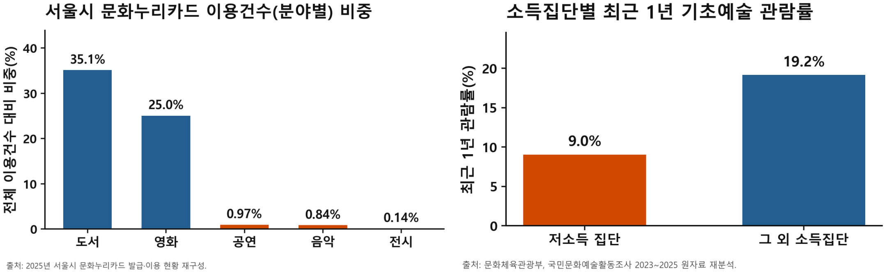
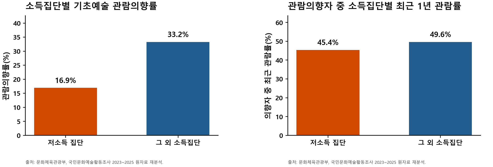
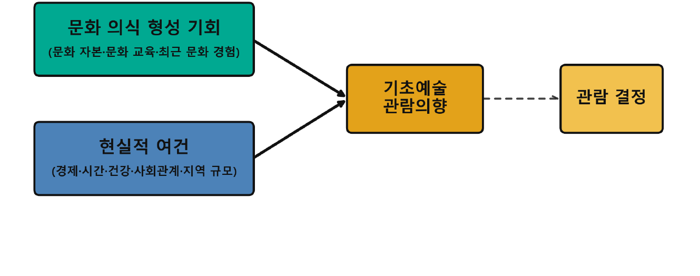
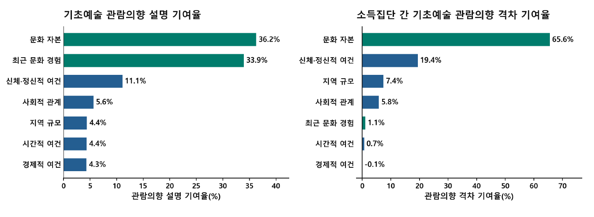
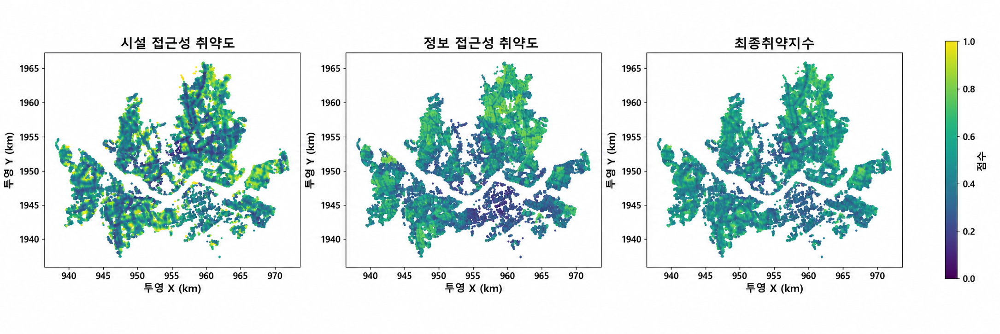

# 서울시 고령층 문화 이용 취약권역 분석

**문화누리카드**는 저소득 계층에 문화비를 지원하여, 문화 향유의 비용 진입 장벽을 낮추고 계층 간 문화 접근 기회와 향유 불균형을 해소하고자 시작된 공공 사업입니다.

그러나 2025년 문화누리카드 이용실적 보고서에 따르면, 대부분의 이용이 도서와 영화에 집중되어 있으며(약 60%), 공연, 전시, 연극 등 기초문화예술(이하 ‘기초예술’)의 이용은 극히 제한되어 있습니다(1% 내외).

본 프로젝트는 그 불균형으로부터 출발하여, 불균형의 원인을 찾고 해결책을 제시하여 실질적인 문화 접근 기회 보장에 보탬이 되고자 시작되었습니다. 특히 문화 접근 기회와 디지털 정보 탐색이 취약한 고령층이 밀집된 지역을 찾아 정책 검토에 활용할 수 있도록 했습니다.

- **진행 기간**: 26.07 - 26.09
- **기술**: Python, Jupyter, GeoPandas, NetworkX·OSMnx, scikit-learn, JavaScript·Leaflet
- **개발 지원**: Codex
- **참여 인원**: 박중현, 전형빈, 최윤선, 박주안
- **결과물**: [취약권역 지도 프로토타입](https://jhpark-kor.github.io/sgis-project/), 데이터 분석 보고서

<br><br>

## 분석 과정

**EDA · 문제 원인 분석 → 지역별 고령 인구 추정 → 문화시설 접근성·디지털 이용량 분석 → 지역별 취약 점수 산출 → 취약 지역 권역화 → 정책 대시보드 구현 및 배포**

- EDA · 문제 원인 분석: 공개용 코드 정리 중
- 지역별 고령 인구 추정: [`code/02_population_estimation`](code/02_population_estimation/)
- 문화시설 접근성·디지털 이용량 분석: [`code/03_accessibility`](code/03_accessibility/), [`code/03_abstract`](code/03_abstract/)
- 지역별 취약 점수 산출: [`code/05_final_score`](code/05_final_score/)
- 취약 지역 권역화: [`code/06_vulnerability_region`](code/06_vulnerability_region/)
- 정책 대시보드 구현 및 배포: [프로토타입](https://jhpark-kor.github.io/sgis-project/)

<br><br>

## 주요 결과

### 1. 저소득층의 기초문화예술 이용 저조


- 결과1 : 2025년 서울시 이용 비중은 도서 35.1%, 영화 25%인 반면 공연 0.97%, 전시 0.14%였습니다.
- 결과2 : 소득이 낮은 집단은 그렇지 않은 집단에 비해 최근 기초예술 경험이 약 2배 낮았습니다.
- 시사점: 소득 별 기초 문화 예술 경험 편차가 낮은 만큼, 저소득층의 기초예술 이용 장벽을 별도로 살펴볼 필요가 있다고 판단했습니다.

<br><br>

### 2. 넘어서기 힘든 ‘문화자본’의 장벽: 근본적인 관람 동기를 형성


- 결과 1: 저소득 집단과 그 외 소득집단의 ‘향후 기초예술 관람 의향’을 비교 분석한 결과, 저소득 집단은 기초예술에 대한 관람 의향 자체가 상대적으로 부족하다는 것을 확인했습니다. (16.9% vs 33.2%, 약 2배)
- 결과 2: 반면 의향이 있는 사람 중 최근 관람 비율은 집단 간 차이를 거의 보이지 않았습니다.
- 시사점: 따라서 의향 자체의 격차를 상쇄한다면, 집단 간 이용 불균형이 보다 완화될 가능성이 있으며, 이는 관람 결정 **이전의 의향 형성 과정**에도 주목할 필요가 있음을 시사합니다.

<br><br>


- 가설: **소득 집단 간 기초예술 관람 의향 격차는 현실적 여건(시간, 비용, 건강, 접근성)보다 문화 의식 형성 기회(문화 자본·교육·경험) 차이에 의해 더 많이 설명된다 -** 부르디외(Bourdieu, 1986)의 ‘문화자본론’에서 착안


\*문화자본론: ‘개인의 가정환경과 어린 시절 교육 등 축적된 문화 자본에 의해서 문화에 대한 관심과 의향을 형성된다는 이론

<br><br>


- 분석방법: 국민문화예술활동조사의 응답자료로부터 설명변수와 목표변수를 만들고 로지스틱 회귀모델과 shapely 격차 분해 기법을 사용했습니다.
- 결과1: 문화 자본과, 최근 문화 경험이 현실적인 여건보다 의향에 더 크게 기여한 것으로 나타났습니다.
- 결과2: 반면, 집단 간 격차 설명력에서는 문화 자본의 영향력이 늘어난 반면 최근 문화 경험은 축소되었습니다. 이는 최근 문화 경험 유무는 집단 간 차이가 크지 않기 때문입니다.
- 시사점: 일회성의 참여 독려나 문화 교육만으로는 관람 의향을 제고시킬 수 없습니다. 문화자본의 영향력이 큰 만큼, 장기적인 접점 연결 계획과 지속적인 관리와 교육이 필요합니다.

<br><br>

### 3. 지역별 취약점수 도출


- 고령인구는 이동과 정보 탐색 능력이 상대적으로 취약합니다. 이는 기초 예술에 대한 접점을 더욱 어렵게 만듭니다.
- 따라서 시설까지의 이동이 불편하고 정보 역량이 부족한 지역을 찾을 수 있는 지표를 설계했습니다.
- 이동의 불편함은 시설까지의 경사도와 배차간격 시간으로, 정보 접근성은 다수의 문화예술 관련 정보가 디지털 매체로 제공되는 만큼 모바일 이용량 부족도로 나타내었습니다.

<br><br>

### 4. 취약권역

[취약권역 지도 프로토타입 열기](https://jhpark-kor.github.io/sgis-project/)

- DBSCAN 군집 기법으로 취약점수가 높은 인접 격자를 묶어 223개 권역을 도출했습니다.
- 구·동별로 취약 구역의 밀집 정도를 파악하고, 문화 관련 서비스 공급 시 밀집 지역 중심으로 효율적인 인력과 예산의 분배가 가능하도록 설계했습니다.

<br><br>

## 파일 구조

- `code/`: 분석 단계별 코드와 대시보드
- `data/`: 원자료, 처리 데이터, 지도용 데이터의 위치와 설명
- `output/`: 공개하기로 한 시각자료와 문서

```text
code/
  01_eda/                    이용 현황 분석
  02_population_estimation/  지역별 인구 추정
  03_accessibility/          문화시설 접근성 분석
  03_abstract/               비물리적 지표 분석
  05_final_score/            최종 취약점수
  06_vulnerability_region/   DBSCAN 취약권역
  07_dashboard/              대시보드

data/
  raw/                       원자료
    population/              인구 원자료
    culture_facilities/      문화시설 원자료
    mnc_merchants/           문화누리카드 관련 원자료
    spatial/                 격자·행정구역·지형
    network/                 네트워크 원자료
    transport/               대중교통 원자료
  processed/                 분석용 처리 결과
    spatial/                 분석용 격자
    estimated_population/    추정 총인구
    estimated_target_population/ 추정 대상인구
    external_population/     서울 외 인접지역 인구
    physical_index/          시설 접근성 지표
    nonphysical_index/       비물리적 지표
    final_score/             최종 취약점수
    vulnerability_region/    취약권역
  dashboard/                 대시보드용 경량 데이터
  metadata/                  데이터 설명

output/
  image/                     시각자료
    readme/                  README에 사용한 그래프·도식
  report/                    보고서
  doc/                       기타 문서
```
