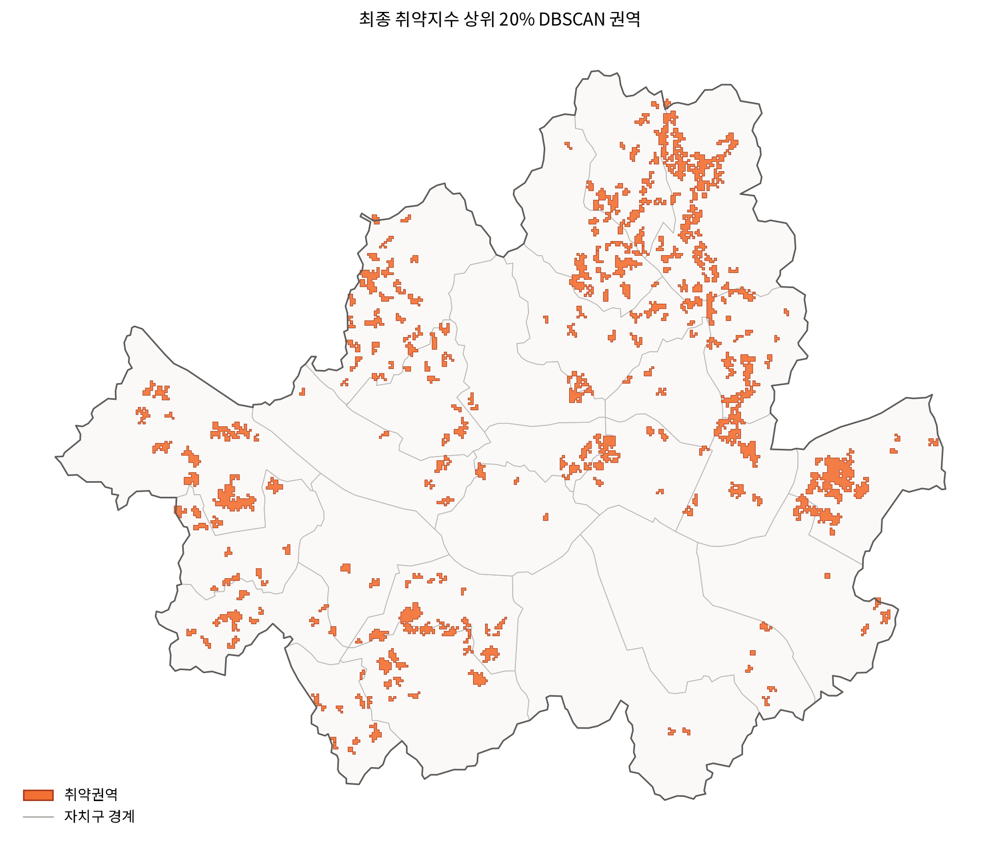

# 서울시 고령층 문화 이용 취약권역 분석

**문화구 효자동**은 문화누리카드의 기초문화예술 이용 불균형을 살펴보고, 고령 취약계층의 문화시설·정보 접근이 어려운 지역을 찾는 프로젝트입니다.

문화누리카드는 저소득 계층의 문화비 부담을 덜고 문화 향유 기회를 넓히기 위한 사업입니다. 그러나 2025년 서울시 이용 실적에서 도서와 영화가 약 60%를 차지한 반면, 공연과 전시 이용 비중은 각각 0.97%, 0.14%였습니다. 우리는 이 차이가 어디에서 비롯되는지 살펴보고, 지역에서 확인할 수 있는 접근성 문제를 정책 검토에 활용하고자 했습니다.

- **진행 기간:** 2026.07–2026.09
- **기술:** Python, Jupyter, GeoPandas, NetworkX·OSMnx, scikit-learn, JavaScript·Leaflet
- **개발 지원:** Codex
- **참여 인원:** 박중현, 전형빈, 최윤선, 박주안
- **결과물:** [취약권역 지도 프로토타입](https://jhpark-kor.github.io/sgis-project/) · 데이터 분석 보고서 작성 중

## 분석 과정


| 단계 | 확인한 내용 | 코드 |
| --- | --- | --- |
| 이용 현황과 원인 분석 | 기초예술 이용·관람 의향의 소득집단 간 차이 | 공개용 EDA 코드 정리 중 |
| 지역별 고령인구 추정 | 100m 격자별 고령 취약인구 | [`code/02_population_estimation`](code/02_population_estimation/) |
| 문화시설 접근성 분석 | 도보·대중교통으로 시설에 닿기 어려운 정도 | [`code/03_accessibility`](code/03_accessibility/) |
| 정보 접근성과 최종 취약점수 | 취약노인 규모·모바일 이용량 부족도와 시설 접근성 | [`code/03_abstract`](code/03_abstract/), [`code/05_final_score`](code/05_final_score/) |
| 취약지역 권역화 | 점수가 높은 인접 격자를 DBSCAN으로 연결 | [`code/06_vulnerability_region`](code/06_vulnerability_region/) |
| 정책 지도 구현 | 권역 순위, 선정 근거, 시설 도달 정보 | [지도 프로토타입](https://jhpark-kor.github.io/sgis-project/) |

## 주요 결과

### 1. 기초예술 이용은 다른 분야보다 낮았습니다

| 2025년 서울시 문화누리카드 이용 분야 | 도서 | 영화 | 공연 | 전시 |
| --- | ---: | ---: | ---: | ---: |
| 이용 비중 | 35.1% | 25.0% | 0.97% | 0.14% |

- **결과:** 도서·영화에 이용이 집중됐고, 저소득 집단의 최근 기초예술 경험은 다른 소득집단보다 약 2배 낮았습니다.
- **시사점:** 비용을 지원하는 사업 안에서도 이용 분야는 고르게 분포하지 않았습니다. 기초예술 이용이 낮은 이유를 따로 살펴볼 필요가 있습니다.

### 2. 이용 격차는 관람 의향에서도 나타났습니다

| 기초예술 관람 의향 | 저소득 집단 | 그 외 소득집단 |
| --- | ---: | ---: |
| 향후 관람 의향이 있는 비율 | 16.9% | 33.2% |

- **결과:** 관람 의향은 저소득 집단에서 낮았지만, 의향이 있는 사람들의 최근 관람 비율은 소득집단 간 차이가 약 4%p였습니다.
- **시사점:** 관람을 실행할 때의 제약뿐 아니라, 관람 의향이 낮게 형성되는 이유도 이용 격차를 이해하는 중요한 단서입니다.

관람 의향에 영향을 줄 수 있는 요인을 살펴보기 위해 국민문화예술활동조사 응답자료로 로지스틱 회귀모형을 만들고, Shapley 방식으로 집단 간 격차를 분해했습니다. 분석의 출발점은 문화자본·교육·경험의 차이가 관람 의향과 관련될 수 있다는 가설입니다.

| 분석 결과 | 눈에 띄는 값 |
| --- | --- |
| 관람 의향 설명 | 문화자본 36.2%, 최근 간접경험 33.9%, 현실적 여건 29.8% |
| 소득집단 간 의향 격차 설명 | 문화자본 65.6%, 최근 간접경험 1.1% |

- **결과:** 관람 의향 자체를 설명할 때와 소득집단 간 *격차*를 설명할 때 두드러지는 요인이 달랐습니다. 집단 간 격차에서는 문화자본의 설명 비중이 컸습니다.
- **시사점:** 한 번의 참여 독려에 그치기보다, 기초예술을 접하고 익숙해질 기회를 지속해서 제공하는 방안도 검토할 필요가 있습니다. 이 수치는 변수의 통계적 설명 비중이며 정책 효과를 직접 측정한 값은 아닙니다.

### 3. 격자별 취약점수를 계산했습니다

시설 접근성은 도보·대중교통으로 문화시설에 닿기 어려운 정도를 나타냅니다. 경사, 이동시간, 배차·대기 등 실제 이동 여건을 반영했습니다. 정보 접근성은 취약노인 규모와 지역의 모바일 이용량 부족도를 대표값으로 사용했습니다. 두 점수를 함께 고려해 최종 취약점수를 산출했습니다.

- **결과:** 취약노인이 있는 서울시 100m 격자 21,263개에 점수를 부여했습니다.
- **시사점:** 어느 지역에서 시설 접근과 정보 접근의 어려움이 함께 나타나는지 비교할 수 있습니다. 모바일 이용량은 지역 수준의 대리 지표로, 개인의 정보 탐색 능력을 직접 측정한 값은 아닙니다.

### 4. 점수가 높은 격자를 취약권역으로 묶었습니다



- **결과:** 최종 취약점수 상위 20% 격자에 DBSCAN을 적용해 223개 권역을 도출했습니다. 권역에 포함된 격자는 3,545개입니다.
- **시사점:** 개별 격자보다 연속된 취약지역을 먼저 확인하고, 현장 조사와 문화서비스 공급을 검토할 단위를 정할 수 있습니다. 권역 선정은 사업 효과나 예산 효율성을 입증한 결과는 아닙니다.

지도에서는 권역·격자 전환, 지역 검색, 권역 순위와 선정 근거, 문화시설까지의 도달 정보를 확인할 수 있습니다. **[프로토타입 열기](https://jhpark-kor.github.io/sgis-project/)**

## 한계와 다음 단계

- 이 지도는 우선 살펴볼 지역을 보여주지만, 해당 지역의 실제 문화누리카드 이용 저조 원인이나 서비스 제공 후 이용 증가를 검증한 결과는 아닙니다.
- 현재 시설 접근성 분석은 확보된 공연시설과 소수의 스포츠관람시설을 대상으로 했습니다. 전시 등 기초예술 전 분야의 접근성을 대표하지는 않습니다.
- 분석 대상을 서울의 고령 취약계층에서 취약계층 전체와 서울 외 지역으로 넓힐 계획입니다. 이후 실제 이용 자료와 연결해 권역 선정 결과도 점검하겠습니다.

## 파일 구조

```text
code/
  01_eda/                    이용 현황 분석 코드 정리 공간
  02_population_estimation/  100m 격자 인구·취약인구 추정 노트북
  03_accessibility/          보행·대중교통 경로와 시설 접근성
  03_abstract/               취약노인 규모·모바일 이용량 지표
  05_final_score/            최종 취약점수 산출·검증
  06_vulnerability_region/   DBSCAN 취약권역 도출
  07_dashboard/              지도 프로토타입 코드 정리 공간

data/
  raw/                       원본 자료
    population/              인구·인구특성
    culture_facilities/      문화시설
    mnc_merchants/           문화누리카드 이용·가맹점
    spatial/                 격자·행정경계·지형
    network/                 교통 네트워크
    transport/               대중교통 운행 자료
  processed/                 분석 코드로 재생성하는 결과
    spatial/                 분석용 100m 격자
    estimated_population/    추정 총인구
    estimated_target_population/ 추정 취약인구
    external_population/     서울 외 인접 지역 인구
    physical_index/          시설 접근성 지표
    nonphysical_index/       정보 접근성 지표
    final_score/             최종 취약점수
    vulnerability_region/    DBSCAN 취약권역
  dashboard/                 지도에 필요한 경량 데이터
  metadata/                  데이터 설명

output/
  image/                     공개 시각자료
  report/                    보고서
  doc/                       기타 문서
```

원자료와 대용량 처리 데이터는 저장소에 포함하지 않습니다. 데이터 구성은 [`data/metadata/data_metadata.md`](data/metadata/data_metadata.md), 팀 작업 규칙은 [`CONTRIBUTING.md`](CONTRIBUTING.md)에서 확인할 수 있습니다.

**주요 자료:** 2025년 서울 문화누리카드 발급·이용 현황, 국민문화예술활동조사(2023–2025년 통합 재구성), SGIS 격자·인구 통계. 수치와 도식의 상세 산출 과정은 분석보고서 공개 시 함께 제공할 예정입니다.
